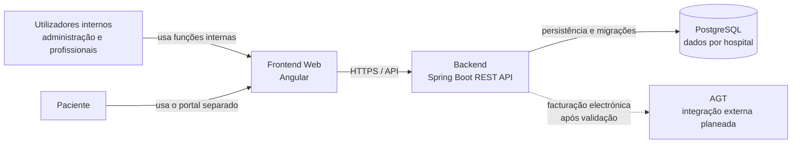

# Arquitectura-alvo

Este documento descreve a arquitectura pretendida para o Ngola Health. É uma
referência para o desenvolvimento faseado, não uma descrição garantida do
protótipo actualmente existente nem uma declaração de que todos os componentes
estejam implementados. As decisões técnicas ainda propostas permanecem sujeitas
às respectivas ADRs.

## Diagrama de contexto



O frontend é o ponto de acesso às funções da aplicação. A API aplica
autenticação, autorização, validação e regras de negócio antes de aceder aos
dados. A integração com a AGT é futura e depende da validação dos requisitos
vigentes, conforme a [ADR-0009](adr/0009-agt-invoicing.md).

O portal do paciente deve manter credenciais, papel e *audience* separados dos
usados pelos utilizadores internos. A separação lógica no frontend não
substitui as verificações de autorização e isolamento efectuadas no backend.

## Componentes e responsabilidades

### Frontend

O frontend será desenvolvido em Angular, com componentes standalone,
organização por funcionalidades, rotas lazy e os padrões descritos na
[ADR-0007](adr/0007-frontend.md). A estrutura prevista separa:

- `core/`: autenticação, interceptors, guards e cliente/tipos gerados da API;
- `shared/`: componentes, directivas e pipes reutilizáveis;
- `features/<module>/`: páginas e componentes próprios de cada módulo.

Os textos apresentados às pessoas são escritos em português; identificadores
e nomes técnicos permanecem em inglês, conforme a
[ADR-0001](adr/0001-language.md).

### Backend

O backend será uma aplicação Spring Boot organizada por módulos de domínio.
Cada módulo mantém as suas responsabilidades separadas nas camadas `api`,
`application`, `domain` e `infrastructure`:

- `api/`: controladores, contratos e validação da entrada e saída;
- `application/`: casos de uso e colaboração entre componentes;
- `domain/`: regras e conceitos próprios do módulo;
- `infrastructure/`: persistência e integrações técnicas.

O pacote base previsto é `ao.ngolahealth`. Configuração transversal e
capacidades comuns ficam fora dos módulos em `config/` e `common/`,
respectivamente. A implementação deve manter serviços pequenos e coesos, com
um serviço por caso de uso quando necessário.

### Base de dados

PostgreSQL é a base de dados relacional prevista. O esquema evolui com
migrações Liquibase em SQL formatado; o master XML serve apenas para incluir
os ficheiros na ordem de dependência, conforme a
[ADR-0005](adr/0005-database-migrations.md).

Os dados pertencentes a um hospital incluem `hospital_id`. O isolamento deve
ser automático na persistência e provado com testes entre hospitais. O
mecanismo concreto do Hibernate ainda depende da confirmação da
[ADR-0003](adr/0003-multi-hospital.md).

### Infraestrutura e integrações

A infraestrutura local inicial prevista contém PostgreSQL, backend e
frontend. Não se introduzem serviços como Redis, RabbitMQ, MinIO, SMTP ou
WebSocket sem um caso de uso concreto e uma decisão registada na
[ADR-0006](adr/0006-infrastructure.md).

Integrações externas, incluindo a AGT, ficam atrás das interfaces e dos
componentes de integração próprios do backend. Credenciais e chaves são
carregadas de fora do repositório, segundo a
[ADR-0008](adr/0008-secrets-management.md).

## Fronteiras entre módulos

Os módulos do backend não acedem directamente às camadas internas uns dos
outros. Quando um caso de uso requer colaboração com outro módulo, a
comunicação passa pela camada `application` exposta por esse módulo. As
fronteiras são verificadas por testes ArchUnit, previstos na Tarefa 1.9.

Casos de uso que coordenam operações de vários módulos ficam na camada de
aplicação da raiz (`ao.hospitalao.application`). Tipos de persistência
transversais, como a base de isolamento por hospital, ficam fora de
`modules/`, em `ao.hospitalao.shared`.

Esta regra mantém a propriedade e a evolução dos dados no módulo responsável
e reduz dependências entre detalhes de implementação. A sequência de entrega
de funcionalidades segue as etapas de base de dados, API, interface e
documentação definidas no [guia de contribuição](../CONTRIBUTING.md).

## Estrutura-alvo do repositório

```text
ngola-health/
├── backend/                          # Spring Boot; pacote base ao.ngolahealth
│   └── src/main/
│       ├── java/ao/ngolahealth/
│       │   ├── config/               # segurança, OpenAPI, propriedades
│       │   ├── common/               # erros, paginação, auditoria, hospital actual
│       │   └── modules/<module>/
│       │       ├── api/
│       │       ├── application/
│       │       ├── domain/
│       │       └── infrastructure/
│       └── resources/db/changelog/
│           ├── db.changelog-master.xml
│           └── changes/<module>/NNN-descricao.sql
├── frontend/                         # Angular
│   └── src/app/
│       ├── core/                     # auth, interceptors, guards, API gerada
│       ├── shared/                  # componentes e pipes reutilizáveis
│       └── features/<module>/       # funcionalidades
├── infra/                            # Compose, nginx e scripts de BD
├── docs/                             # documentação em português
│   ├── adr/
│   ├── modules/
│   ├── agt/
│   ├── security/
│   └── operations/
├── scripts/                          # utilitários de desenvolvimento e operação
├── .github/                          # workflows e templates
├── .editorconfig
├── .gitattributes
├── .gitignore
├── .env.example
├── CONTRIBUTING.md
├── SECURITY.md
├── CHANGELOG.md
└── README.md
```

Esta estrutura é o alvo descrito no roadmap. Pastas podem ser criadas quando
uma tarefa lhes der conteúdo concreto; a existência de uma pasta não é, por si
só, requisito para concluir a fundação.

## Atributos de qualidade

- **Segurança:** autorização negada por omissão, separação entre portal e
  utilizadores internos, gestão segura de segredos e erros sem exposição de
  detalhes internos fora de `dev`.
- **Isolamento:** dados de hospitais diferentes não se cruzam; a regra é
  transversal e testada.
- **Evolução:** contratos da API e documentação acompanham as alterações;
  módulos comunicam pelas fronteiras definidas.
- **Verificabilidade:** CI executa testes e validações; migrações são
  aplicáveis a uma base de dados vazia; regras arquitecturais são automatizadas.
- **Operabilidade:** serviços de infraestrutura só são adicionados para
  necessidades concretas e documentadas.

Os requisitos transversais completos estão na secção 2 do
[roadmap](ROADMAP.md), e o estado das decisões está nos documentos de
[ADR](adr/).
