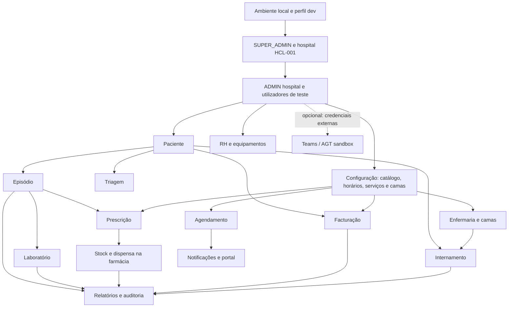

# Guia de testes manuais ponta a ponta

Este guia conduz uma validação manual do Ngola Health executado localmente,
desde a preparação do ambiente até aos fluxos clínicos e administrativos. A
ordem respeita as dependências entre módulos. Use exclusivamente dados
sintéticos: a aplicação local não deve receber dados reais de pacientes nem
credenciais de produção.

Os desenhos de ecrã abaixo são **esquemas ilustrativos**, não capturas da
interface. Os nomes e os estados podem variar ligeiramente conforme a versão
do frontend. As regras funcionais descritas reflectem o comportamento
implementado; este guia não é um protocolo clínico nem uma aprovação para uso
assistencial ou produção.

## 1. Preparar o ambiente

1. Siga [o guia de desenvolvimento](development.md) para configurar o `.env`
   e iniciar a aplicação:

   ```sh
   docker compose config --quiet
   docker compose up --build --detach
   docker compose ps
   ```

2. Confirme que os serviços estão saudáveis:

   - Interface: <http://localhost:4200>
   - Health check da API: <http://localhost:8080/api/actuator/health>
   - Swagger no perfil local: <http://localhost:8080/api/swagger-ui.html>

3. Abra a interface e confirme que a página de entrada carrega. Se o backend
   ainda estiver a iniciar, aguarde e consulte `docker compose logs backend`.

4. Entre com o email `platform-admin@hospitalao.local` e a senha inicial
   configurada em `DEV_ADMIN_INITIAL_PASSWORD_BASE64` no `.env`. A senha é a
   original antes da codificação Base64. A conta de desenvolvimento pertence
   ao perfil `SUPER_ADMIN` e não tem hospital associado.

### Preparar um utilizador ADMIN do hospital

O seed local cria o `SUPER_ADMIN`, mas não cria um `ADMIN` associado ao
hospital. Além disso, a interface não disponibiliza um fluxo de troca da senha
temporária. Para testar os módulos com âmbito hospitalar, é necessário criar
uma conta local de teste uma vez. O procedimento abaixo copia o hash da senha
do `platform-admin` (não a senha em texto), cria um `ADMIN` para o hospital
sintético `HCL-001` e permite entrar com a senha local já configurada:

```sh
docker compose exec -T postgres sh -c \
  'psql -v ON_ERROR_STOP=1 -U "$POSTGRES_USER" -d "$POSTGRES_DB"' <<'SQL'
BEGIN;

INSERT INTO users (
    full_name, username, password_hash, email, register_status,
    must_change_password, hospital_id
)
SELECT
    'Administrador Local de Teste',
    'admin-local-teste',
    source.password_hash,
    'admin-local-teste@hospitalao.local',
    'ACTIVE',
    FALSE,
    hospital.id
FROM users AS source
JOIN hospitals AS hospital ON hospital.code = 'HCL-001'
WHERE source.username = 'platform-admin'
ON CONFLICT (username) DO NOTHING;

INSERT INTO user_roles (user_id, role_id)
SELECT app_user.id, role.id
FROM users AS app_user
CROSS JOIN roles AS role
WHERE app_user.username = 'admin-local-teste'
  AND role.name = 'ADMIN'
ON CONFLICT DO NOTHING;

COMMIT;
SQL
```

Depois, entre com `admin-local-teste@hospitalao.local` e a mesma senha local
do `platform-admin`. **Este atalho só é aceitável numa base descartável de
desenvolvimento**, protegida e sem acesso externo: as duas contas partilham o
hash da senha. Não o use em homologação partilhada ou produção. A conta
`ADMIN` dá acesso a operações hospitalares; conserve o `SUPER_ADMIN` apenas
para administração da plataforma.

Se a operação falhar, confirme que o perfil `dev` aplicou as migrações, que o
hospital `HCL-001` existe e que a conta `platform-admin` foi criada. Não
contorne as restrições de tenant nem execute o procedimento numa base com
dados reais.

## 2. Dados, papéis e critérios

### Regras para os dados de teste

- Use nomes identificáveis como `TESTE - Paciente Fluxo Manual`, telefones
  reservados para teste e endereços `@hospitalao.local`.
- O seed de desenvolvimento inclui o paciente
  `Paciente Demonstração - Dados Sintéticos` no hospital `HCL-001`.
- O seed **não** preenche todos os catálogos, horários, lotes de farmácia,
  preços, enfermarias ou contas do portal. Prepare apenas os dados de
  configuração necessários ao módulo que vai testar.
- Não presuma que criar um paciente cria uma triagem, episódio, pedido de
  laboratório, prescrição ou marcação. São fluxos separados.
- Para cada passo, registe: resultado esperado, resultado observado,
  identificador gerado e `PASSOU`/`FALHOU`. Não inclua senhas, tokens ou
  informação pessoal em capturas e relatórios.

### Papéis de teste

Comece com o `ADMIN` local e, através de **Utilizadores**, crie contas
sintéticas separadas para os papéis que pretende validar:

| Papel | Áreas típicas a validar |
| --- | --- |
| `ADMIN` | Configuração e operação do hospital |
| `MANAGER` | Gestão, relatórios, RH, auditoria e equipamentos |
| `RECEPTIONIST` | Pacientes, marcações e apoio ao portal |
| `DOCTOR` | Episódios, triagem, pedidos clínicos e telemedicina |
| `NURSE` | Pacientes, triagem, laboratório e internamento |
| `LAB_TECHNICIAN` | Processamento de pedidos de laboratório |
| `PHARMACIST` | Catálogo, stock e dispensa |
| `FINANCIAL` | Facturação |
| `SUPER_ADMIN` | Gestão da plataforma e hospitais; não substitui o `ADMIN` do hospital |

Os menus são uma conveniência visual; a API é quem aplica as permissões.
Teste as operações com o papel autorizado e confirme que uma operação não
autorizada é recusada, não apenas escondida no menu. Os acessos concretos
dependem também da regra de cada operação; consulte
[segurança e perfis](security.md).

## 3. Ordem de dependências



O diagrama expressa pré-requisitos de teste, não automatizações. Laboratório e
prescrição podem ser testados sem executar todos os passos anteriores, desde
que existam os respectivos registos e catálogos. O AGT e o Teams são
integrações externas opcionais.

### Esquema ilustrativo: navegação

```text
┌──────────────────── Ngola Health ───────────────────────────┐
│ Utilizador: Admin Local                 [Notificações] [Sair]│
├──────────────────┬──────────────────────────────────────────┤
│ Dashboard        │                                          │
│ Pacientes        │             Área de trabalho              │
│ Consultas        │                                          │
│ Agendamento      │      Lista, formulário ou detalhe         │
│ Internamentos    │      conforme o módulo escolhido          │
│ Laboratório      │                                          │
│ Farmácia         │                                          │
│ Facturação       │                                          │
│ Utilizadores     │                                          │
└──────────────────┴──────────────────────────────────────────┘
```

## 4. Entrada, sessão e dashboard

1. Abra `/login`, introduza o email e a senha local e seleccione **Entrar no
   Sistema**.
2. **Esperado:** a sessão abre e navega para `/dashboard`.
3. Actualize a página. **Esperado:** a sessão válida permanece activa.
4. Seleccione **Sair** e tente abrir `/patients` directamente.
   **Esperado:** a aplicação exige autenticação e regressa ao login.
5. Entre novamente com `ADMIN`; confirme que o dashboard mostra dados do
   hospital activo e que o menu apresenta módulos disponíveis para esse papel.
6. Repita uma operação protegida com um papel sem essa permissão. Registe a
   recusa da API como teste de autorização.

### Esquema ilustrativo: login

```text
┌────────────────────────────────────────────┐
│                 Ngola Health               │
│                                            │
│  Email      [ admin-local-teste@...     ]  │
│  Palavra-passe [••••••••••••••••••••••]   │
│                                            │
│                 [ Entrar no Sistema ]       │
│  Resultado esperado: abrir o dashboard     │
└────────────────────────────────────────────┘
```

## 5. Utilizadores e configuração do hospital

1. Como `ADMIN`, abra **Utilizadores** (`/users`) e crie pelo menos um
   utilizador sintético para cada papel que pretende testar. Use emails
   únicos e não reutilize a conta `SUPER_ADMIN`.
2. Se existir opção de atribuição do papel `DOCTOR`, crie ou actualize um
   médico de teste. Confirme que contas inactivas ou sem o papel adequado não
   aparecem como profissionais elegíveis.
3. Saia e autentique-se com duas contas de papéis diferentes. Compare os
   menus e teste directamente uma operação que deva ser proibida para a
   segunda conta.
4. Como `SUPER_ADMIN`, confirme o hospital de demonstração em `/hospitals`.
   Não crie um segundo hospital para esta sequência: os restantes testes usam
   o tenant `HCL-001`.

**Esperado:** cada conta entra com o papel atribuído e os registos criados
permanecem no hospital activo. O `SUPER_ADMIN` não deve ser tratado como
substituto do `ADMIN` hospitalar.

## 6. Catálogos e pré-requisitos operacionais

Antes de testar os fluxos dependentes, prepare apenas o que estiver em falta:

- **Farmácia:** medicamento activo e lote com quantidade disponível e validade
  futura. Use a área **Farmácia** (`/pharmacy`). A dispensa deve consumir os
  lotes pela regra FEFO (*First Expired, First Out*).
- **Laboratório:** exame activo no catálogo, se ainda não existir. O fluxo de
  pedidos requer pelo menos um exame disponível.
- **Facturação:** preço de serviço activo associado ao hospital. Sem preço,
  não será possível testar uma factura válida.
- **Agendamento:** horário activo do médico, com dia, intervalo, duração e
  capacidade válidos. Crie-o em `/scheduling/schedules`.
- **Internamento:** enfermaria e cama `AVAILABLE`, criadas em
  `/inpatient/setup`.

Não crie dados fictícios através de endpoints não documentados só para fazer
passar o teste. Se um catálogo não puder ser configurado pela interface ou
pela documentação do módulo, registe-o como pré-requisito em falta e não
marque o fluxo dependente como validado.

## 7. Pacientes, triagem e episódios

### 7.1 Registar e localizar paciente

1. Abra **Pacientes** (`/patients`) e procure primeiro
   `Paciente Demonstração - Dados Sintéticos`.
2. Registe um paciente novo com nome `TESTE - Paciente Fluxo Manual`, data de
   nascimento sintética e género seleccionado. Não preencha NIF ou número de
   processo real.
3. Guarde o identificador apresentado e volte à lista; procure o paciente.
4. Tente criar outro registo com os mesmos dados identificadores usados no
   teste. **Esperado:** a interface/backend sinaliza a possível duplicação ou
   a colisão dos identificadores únicos, conforme os campos preenchidos.
5. Edite um campo não identificador e confirme que a alteração aparece na
   lista. Se testar desactivação, confirme que o registo é preservado e não
   desaparece do histórico.

### 7.2 Registar triagem

1. Com perfil autorizado, abra **Triagem** (`/triage`) e crie uma triagem para
   o paciente de teste; preencha a queixa principal e dados sintéticos.
2. Confirme a prioridade e o estado `WAITING`.
3. Avance para `IN_PROGRESS` e depois `COMPLETED`. Teste `LEFT` apenas num
   registo separado ainda em espera.
4. Tente alterar a prioridade depois de iniciar o atendimento.
   **Esperado:** a alteração não é permitida fora de `WAITING`.
5. Confirme que a triagem não cria automaticamente um episódio.

### 7.3 Criar e concluir episódio

1. Abra **Consultas** (`/episodes`) e crie um episódio para o mesmo paciente,
   com tipo, motivo e informação sintética adequados ao formulário.
2. Confirme o estado inicial `SCHEDULED`; inicie-o e confirme
   `IN_PROGRESS`.
3. Tente concluí-lo antes de iniciar num segundo episódio.
   **Esperado:** transição recusada. No primeiro episódio, conclua depois de
   iniciar e confirme `COMPLETED`.
4. Confirme que criar o episódio não altera automaticamente a triagem.

### Esquema ilustrativo: percurso clínico

```text
Paciente                 Triagem                  Episódio
┌─────────────┐          ┌──────────────┐         ┌──────────────┐
│ Identificação│ ──────> │ Queixa/sinais│         │ Motivo/tipo  │
│ Dados de teste│        │ Prioridade   │         │ Estado       │
└─────────────┘          └──────────────┘         └──────┬───────┘
       └─────────────────────────────────────────────────┘
                  associação não automática
```

## 8. Laboratório e prescrições/farmácia

### 8.1 Pedido e resultado laboratorial

1. Confirme que existe um exame activo e que o paciente está registado.
2. Em **Laboratório** (`/lab`), crie um pedido com o exame. Se associar um
   episódio, escolha o do mesmo paciente.
3. Confirme `PENDING`; avance para `COLLECTED` e depois `IN_ANALYSIS`.
4. Registe um resultado sintético para cada item.
5. **Esperado:** o pedido passa a `COMPLETED` quando todos os resultados
   estiverem registados. Um pedido pendente não deve saltar directamente para
   análise; um pedido concluído não deve aceitar cancelamento.

### 8.2 Prescrição

1. Confirme que o medicamento está activo e que há stock elegível suficiente.
2. Em **Prescrições** (`/prescriptions`), crie uma prescrição para o paciente,
   associada ao episódio (ou internamento, nunca a ambos).
3. Introduza diagnóstico, posologia e quantidade sintéticos. Guarde e confirme
   paciente, medicamento e estado no detalhe.
4. Teste uma quantidade acima do stock disponível numa prescrição separada.
   **Esperado:** operação recusada ou validação apresentada; não deve criar
   uma dispensa com stock negativo.
5. Como `PHARMACIST`, dispense a prescrição válida e confirme a quantidade
   remanescente nos lotes. Verifique FEFO com dois lotes de validade futura,
   se puder preparar ambos.
6. Confirme que uma prescrição cancelada ou expirada não é dispensada.

### Esquema ilustrativo: laboratório e farmácia

```text
Pedido de laboratório                   Prescrição
┌──────────┐  ┌─────────┐  ┌─────────┐  ┌──────────────┐
│ PENDING  │→ │COLLECTED│→ │IN_ANALYSIS│→│ COMPLETED   │
└──────────┘  └─────────┘  └─────────┘  └──────────────┘

┌───────────────┐   stock disponível   ┌────────────────┐
│ Prescrição    │ ───────────────────> │ Dispensa FEFO  │
│ medicamento   │                      │ lote/quantidade│
└───────────────┘                      └────────────────┘
```

## 9. Agendamento e notificações

1. Confirme que o médico de teste tem um horário activo em
   `/scheduling/schedules`.
2. Em `/scheduling`, crie uma marcação futura para o paciente, médico e slot
   disponíveis. Informe o motivo obrigatório.
3. Confirme `SCHEDULED`; confirme a marcação e verifique `CONFIRMED`.
4. Num registo independente, teste cancelar com motivo e registar falta
   (`NO_SHOW`). Num terceiro, conclua (`COMPLETED`) apenas com papel
   autorizado.
5. Tente marcar um slot passado, bloqueado ou sem capacidade.
   **Esperado:** não aparece como disponível ou a API rejeita a criação.
6. Consulte o calendário em `/scheduling/calendar` e as notificações em
   `/notifications`. O cancelamento pode gerar uma notificação interna para o
   médico; isto não equivale a SMS ou email.
7. Se houver conflito de capacidade, escolha outro slot; não repita a mesma
   submissão esperando que o servidor aceite uma marcação concorrente.

## 10. Internamento

1. Como perfil autorizado, abra `/inpatient/setup` e crie uma enfermaria e
   pelo menos duas camas de teste.
2. Confirme no mapa `/inpatient` que as camas novas estão `AVAILABLE`.
3. Em `/inpatient/admissions/new`, admita o paciente de teste com médico
   responsável e cama disponível.
4. **Esperado:** internamento `ACTIVE` e cama `OCCUPIED`.
5. Transfira para a segunda cama e confirme a cama de origem `AVAILABLE` e a
   cama de destino `OCCUPIED`.
6. Registe alta no detalhe do internamento. Confirme o encerramento e a cama
   disponível.
7. Tente usar uma cama ocupada ou em manutenção numa nova admissão.
   **Esperado:** selecção indisponível ou pedido recusado.

## 11. Facturação e AGT sandbox

1. Confirme que há um preço de serviço activo para o hospital.
2. Com `FINANCIAL` (ou perfil autorizado), abra **Facturação**
   (`/financial`) e crie um documento para o paciente, seleccionando o
   serviço de teste.
3. Confirme que o documento aparece na lista e no detalhe com paciente,
   número e total esperados.
4. Tente criar um documento sem paciente ou serviço.
   **Esperado:** validação e nenhum documento incompleto.
5. Por omissão a integração AGT está desactivada (`AGT_ENABLED=false`).
   Teste e registe a facturação local sem a apresentar como factura fiscal
   validada.
6. Só teste emissão no sandbox depois de obter credenciais de homologação,
   preencher as variáveis `AGT_*` locais e activar explicitamente o sandbox.
   Nunca introduza credenciais de produção neste ensaio.

## 12. RH, equipamentos, auditoria e relatórios

### Recursos humanos

1. Como utilizador autenticado, abra `/hr/attendance` e teste entrada e saída
   no próprio registo.
2. Tente fazer um segundo check-in no mesmo dia.
   **Esperado:** duplicação recusada.
3. Submeta um pedido de ausência em `/hr/leaves`; como `MANAGER` ou `ADMIN`,
   aprove ou rejeite-o e confirme o estado.
4. Crie e actualize um turno em `/hr/shifts`; confirme a escala semanal.

### Equipamentos

1. Em `/equipment`, registe um equipamento claramente sintético, com
   identificador e localização de teste.
2. Altere o estado e registe uma manutenção/calibração com datas futuras.
3. Confirme o histórico e os indicadores de manutenção/calibração.

### Auditoria e relatórios

1. Consulte `/audit` com `ADMIN` ou `MANAGER` e localize algumas acções feitas
   nesta sequência.
2. Como utilizador sem acesso administrativo, tente consultar a auditoria.
   **Esperado:** acesso recusado.
3. Abra `/reports` e `/reports/executive` depois de criar dados clínicos,
   financeiros e operacionais.
4. Gere os relatórios disponíveis e confirme que reflectem os dados do
   hospital de teste; valide os filtros de datas e os PDFs quando aplicável.
5. Não interprete um dashboard vazio como falha se ainda não tiver criado
   dados do módulo correspondente.

## 13. Portal do paciente e telemedicina

### Portal (opcional)

1. Use um paciente sintético com email de teste e número de processo/NIF
   configurado para demonstração.
2. Em `/portal/login`, solicite uma conta com senha sintética com pelo menos
   12 caracteres.
3. Como `RECEPTIONIST`, `MANAGER` ou `ADMIN`, confirme a solicitação e aprove
   apenas depois de conferir a identidade **sintética**.
4. Entre pelo portal e confirme que o paciente só consulta os seus próprios
   dados. O portal não deve aceitar o token interno da aplicação.
5. Sem aprovação, a autenticação do portal deve ser recusada.

### Microsoft Teams (condicional)

Esta integração requer configuração Microsoft Entra/Graph e credenciais
válidas; não faz parte do arranque local por omissão. Sem a configuração
externa, marque este bloco como **não aplicável**, não como falha. Se a
organização a disponibilizar, siga os pré-requisitos de
[operações e telemedicina](operations.md) e use apenas organizadores de teste.

## 14. Isolamento entre hospitais e segurança

Execute apenas se tiver um segundo tenant de teste configurado de forma
controlada:

1. Crie utilizadores e dados sintéticos separados por hospital.
2. Autentique-se em cada tenant e confirme que listas, pesquisa, notificações,
   relatórios e detalhes só expõem os registos daquele hospital.
3. Tente consultar pela API, com um identificador conhecido do outro tenant,
   um registo que a conta não deve conseguir ver.
4. **Esperado:** sem fuga de dados; a API nega a operação ou não encontra o
   registo, conforme o endpoint.

Não crie um segundo hospital nem altere o tenant do utilizador de teste na
base de dados principal apenas para executar este cenário. Consulte
[segurança](security.md) para os controlos e limitações do isolamento.

## 15. Fecho, evidências e limpeza

Para cada cenário, preencha:

| Campo | Registo |
| --- | --- |
| Cenário / módulo | |
| Papel utilizado | |
| Pré-requisitos presentes | |
| Passos executados | |
| Resultado esperado | |
| Resultado observado | |
| Identificador sintético do registo | |
| Estado | PASSOU / FALHOU / NÃO APLICÁVEL |
| Evidência sem dados sensíveis | |

No fim:

1. Termine a sessão na interface.
2. Registe falhas com rota, papel, hora aproximada e identificador sintético;
   remova tokens e dados pessoais de qualquer evidência.
3. Prefira cancelar ou desactivar registos de teste pela aplicação, quando
   suportado. Não apague histórico clínico para “limpar” o cenário.
4. `docker compose down` pára os serviços e preserva os volumes. **Não execute
   `docker compose down --volumes`** salvo se quiser intencionalmente apagar
   toda a base de dados e os dados locais.
5. Se activar backups locais, siga a secção de backups em
   [desenvolvimento](development.md); os ficheiros cifrados ficam em
   `backups/`, não em S3.

## Referências funcionais

- [Fluxo clínico e regras implementadas](clinical-workflow.md)
- [Agendamento, notificações e internamento](scheduling-notifications-inpatient.md)
- [Gestão de RH, equipamentos, dashboards, portal e Teams](operations.md)
- [Segurança, papéis e isolamento multi-hospital](security.md)
- [Execução local, configuração e testes automatizados](development.md)
- [Teste E2E automatizado do fluxo clínico crítico](../frontend/e2e/critical-clinical-flow.spec.ts)
